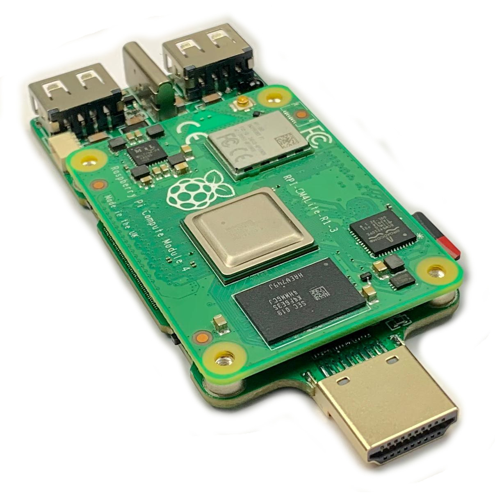
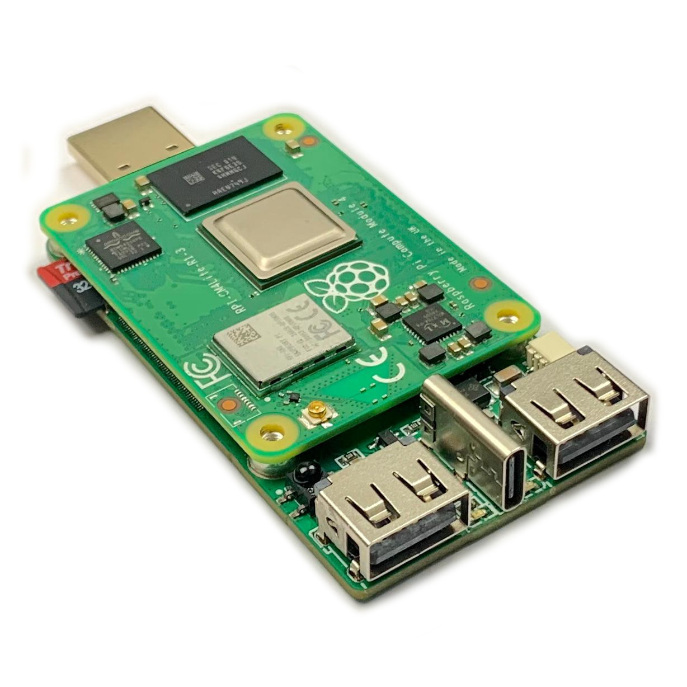

# Raspberry Pi CM4 TV Stick
Raspberry Pi CM4 that plugs directly to TV/monitor

## Specs
- compatible with Raspberry Pi CM4 eMMC and no-eMMC
- HDMI plug
- micro SD card connector
- USB-C connector
- Two USB2.0 USB-A connectors
- USB2.0 as solder pads on reverse side
- IR receiver on GPIO17
- User button on GPIO14 (also tied to nRPIBOOT: hold on power on to enter USB MSD mode for eMMC programming/fw update)
- USB multiplexer selector switch: enable 2xUSB-A ports or CM4 USB device mode
- Power and Act LEDs
- 14 GPIOs, as well as GND, 5V and 3.3V solder pads on reverse side of PCB for hacking 
- Connector for Ambilight-like lightning with WS2812 or WS2801 LEDs (GND, GPIO18, GPIO10 and GPIO11)

## Availability
Online store: https://mbs-shop.online/

Follow on Twitter: [@magic__smoke](https://twitter.com/magic__smoke)

